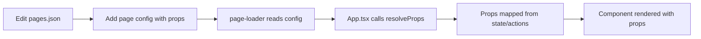

# Declarative Page Configuration System

## Overview

CodeForge uses a **declarative, JSON-driven configuration system** to manage pages, components, props, and layouts. This architecture enables rapid development without modifying core application logic.

## Architecture Diagram

```
┌─────────────────────────────────────────────────────────────┐
│                        App.tsx                               │
│  ┌──────────────────────────────────────────────────────┐   │
│  │  Uses page-loader to:                                 │   │
│  │  • Get enabled pages                                  │   │
│  │  • Resolve component props dynamically                │   │
│  │  • Render pages with correct configuration            │   │
│  └──────────────────────────────────────────────────────┘   │
└─────────────────────────────────────────────────────────────┘
                            ▲
                            │
                            │ imports & uses
                            │
┌─────────────────────────────────────────────────────────────┐
│              page-loader.ts (Resolution Logic)               │
│  ┌──────────────────────────────────────────────────────┐   │
│  │  • getPageConfig()                                    │   │
│  │  • getEnabledPages(featureToggles)                    │   │
│  │  • resolveProps(propConfig, state, actions)           │   │
│  │  • getPageShortcuts()                                 │   │
│  └──────────────────────────────────────────────────────┘   │
└─────────────────────────────────────────────────────────────┘
                            ▲
                            │
                            │ reads
                            │
┌─────────────────────────────────────────────────────────────┐
│            pages.json (Declarative Config)                   │
│  ┌──────────────────────────────────────────────────────┐   │
│  │  {                                                    │   │
│  │    "pages": [                                         │   │
│  │      {                                                │   │
│  │        "id": "models",                                │   │
│  │        "component": "ModelDesigner",                  │   │
│  │        "props": {                                     │   │
│  │          "state": ["models"],                         │   │
│  │          "actions": ["onModelsChange:setModels"]     │   │
│  │        }                                              │   │
│  │      }                                                │   │
│  │    ]                                                  │   │
│  │  }                                                    │   │
│  └──────────────────────────────────────────────────────┘   │
└─────────────────────────────────────────────────────────────┘
                            ▲
                            │
                            │ validates
                            │
┌─────────────────────────────────────────────────────────────┐
│         validate-config.ts (Validation Logic)                │
│  ┌──────────────────────────────────────────────────────┐   │
│  │  • validatePageConfig()                               │   │
│  │  • Checks for duplicate IDs/shortcuts                 │   │
│  │  • Validates state/action keys exist                  │   │
│  │  • Validates resizable configurations                 │   │
│  └──────────────────────────────────────────────────────┘   │
└─────────────────────────────────────────────────────────────┘
                            ▲
                            │
                            │ uses schemas
                            │
┌─────────────────────────────────────────────────────────────┐
│          page-schema.ts (Type Definitions)                   │
│  ┌──────────────────────────────────────────────────────┐   │
│  │  • PropConfigSchema                                   │   │
│  │  • ResizableConfigSchema                              │   │
│  │  • SimplePageConfigSchema                             │   │
│  │  • Zod schemas for runtime validation                 │   │
│  └──────────────────────────────────────────────────────┘   │
└─────────────────────────────────────────────────────────────┘
```

## Core Files

### 1. `pages.json` - Source of Truth

The declarative configuration file that defines all pages, their components, and props.

**Location**: `/src/config/pages.json`

**Purpose**: 
- Define all application pages
- Configure component props mapping
- Set keyboard shortcuts
- Configure resizable layouts
- Enable/disable features

### 2. `page-loader.ts` - Resolution Engine

The TypeScript module that reads and processes the JSON configuration.

**Location**: `/src/config/page-loader.ts`

**Key Functions**:
- `getPageConfig()` - Returns full page configuration
- `getEnabledPages(featureToggles)` - Filters pages based on toggles
- `resolveProps(propConfig, stateContext, actionContext)` - Maps JSON config to actual props
- `getPageShortcuts(featureToggles)` - Extracts keyboard shortcuts

### 3. `validate-config.ts` - Configuration Validator

Validates the pages.json configuration for errors and warnings.

**Location**: `/src/config/validate-config.ts`

**Validates**:
- Required fields (id, title, component)
- Duplicate IDs, shortcuts, or order numbers
- Valid state and action keys
- Resizable configuration correctness
- Feature toggle key validity

### 4. `page-schema.ts` - Type Definitions

Zod schemas and TypeScript types for type-safe configuration.

**Location**: `/src/config/page-schema.ts`

**Exports**:
- `PropConfigSchema` - Props configuration structure
- `ResizableConfigSchema` - Resizable layout structure
- `SimplePageConfigSchema` - Individual page structure
- TypeScript types inferred from schemas

## Data Flow

### Adding a New Page



### Prop Resolution Flow

```
1. Component needs props
   ↓
2. App.tsx calls getPropsForComponent(pageId)
   ↓
3. getPropsForComponent finds page config
   ↓
4. Calls resolveProps(page.props, stateContext, actionContext)
   ↓
5. resolveProps iterates over state/action arrays
   ↓
6. Maps JSON keys to actual values from contexts
   ↓
7. Returns resolved props object
   ↓
8. Props passed to component
```

## Configuration Examples

### Simple Page (Dashboard)

```json
{
  "id": "dashboard",
  "title": "Dashboard",
  "icon": "ChartBar",
  "component": "ProjectDashboard",
  "enabled": true,
  "shortcut": "ctrl+1",
  "order": 1,
  "props": {
    "state": ["files", "models", "components"]
  }
}
```

### Page with Actions (Model Designer)

```json
{
  "id": "models",
  "title": "Models",
  "component": "ModelDesigner",
  "props": {
    "state": ["models"],
    "actions": ["onModelsChange:setModels"]
  }
}
```

### Page with Renamed Props (Flask Designer)

```json
{
  "id": "flask",
  "component": "FlaskDesigner",
  "props": {
    "state": ["config:flaskConfig"],
    "actions": ["onConfigChange:setFlaskConfig"]
  }
}
```

### Resizable Split-Panel Page (Code Editor)

```json
{
  "id": "code",
  "component": "CodeEditor",
  "requiresResizable": true,
  "props": {
    "state": ["files", "activeFileId"],
    "actions": ["onFileChange:handleFileChange"]
  },
  "resizableConfig": {
    "leftComponent": "FileExplorer",
    "leftProps": {
      "state": ["files"],
      "actions": ["onFileSelect:setActiveFileId"]
    },
    "leftPanel": {
      "defaultSize": 20,
      "minSize": 15,
      "maxSize": 30
    },
    "rightPanel": {
      "defaultSize": 80
    }
  }
}
```

## State Context Keys

Available state variables that can be referenced in `props.state`:

- `files` - Project files
- `models` - Data models
- `components` - Component definitions
- `componentTrees` - Component tree structures
- `workflows` - Workflow definitions
- `lambdas` - Lambda functions
- `theme` - Theme configuration
- `playwrightTests` - Playwright tests
- `storybookStories` - Storybook stories
- `unitTests` - Unit tests
- `flaskConfig` - Flask configuration
- `nextjsConfig` - Next.js configuration
- `npmSettings` - NPM settings
- `featureToggles` - Feature toggles
- `activeFileId` - Active file ID

## Action Context Keys

Available action functions that can be referenced in `props.actions`:

- `handleFileChange` - Update file content
- `setActiveFileId` - Set active file
- `handleFileClose` - Close file
- `handleFileAdd` - Add new file
- `setModels` - Update models
- `setComponents` - Update components
- `setComponentTrees` - Update component trees
- `setWorkflows` - Update workflows
- `setLambdas` - Update lambdas
- `setTheme` - Update theme
- `setPlaywrightTests` - Update Playwright tests
- `setStorybookStories` - Update Storybook stories
- `setUnitTests` - Update unit tests
- `setFlaskConfig` - Update Flask config
- `setNextjsConfig` - Update Next.js config
- `setNpmSettings` - Update NPM settings
- `setFeatureToggles` - Update feature toggles

## Benefits of This Architecture

### 1. **Declarative Configuration**
- All pages defined in one place
- Easy to understand at a glance
- No need to read through TypeScript code

### 2. **Separation of Concerns**
- Configuration separate from logic
- Props resolution handled systematically
- Business logic stays in components

### 3. **Type Safety**
- Zod schemas validate runtime data
- TypeScript types ensure compile-time safety
- Catch errors early in development

### 4. **Maintainability**
- Add pages without touching App.tsx logic
- Modify props without code changes
- Clear validation error messages

### 5. **Scalability**
- Easy to add new pages
- Simple to extend prop mappings
- Can add more configuration options

### 6. **Testability**
- Validate configuration independently
- Test prop resolution in isolation
- Mock configurations for testing

## Validation

Run configuration validation:

```bash
# Via TypeScript (if configured)
npm run validate-config

# Or manually import and run
import { validatePageConfig, printValidationErrors } from '@/config/validate-config'
const errors = validatePageConfig()
printValidationErrors(errors)
```

Validation checks:
- ✅ Required fields present
- ✅ No duplicate IDs or shortcuts
- ✅ Valid state/action keys
- ✅ Correct resizable config format
- ✅ Panel sizes sum to 100
- ⚠️ Warnings for missing icons or duplicate orders

## Extending the System

### Adding New State Keys

1. Add state to `useProjectState` hook
2. Add to `stateContext` in `App.tsx`
3. Add to validation in `validate-config.ts`
4. Document in this README

### Adding New Action Keys

1. Create action function in `App.tsx` or hook
2. Add to `actionContext` in `App.tsx`
3. Add to validation in `validate-config.ts`
4. Document in this README

### Adding New Configuration Options

1. Update `pages.json` with new field
2. Update `PageConfig` interface in `page-loader.ts`
3. Update Zod schema in `page-schema.ts`
4. Add validation in `validate-config.ts`
5. Implement logic in `App.tsx`

## Migration Guide

### From Hardcoded Props to JSON Config

**Before** (Hardcoded in App.tsx):
```typescript
const getPropsForComponent = (pageId: string) => {
  const propsMap: Record<string, any> = {
    'ModelDesigner': {
      models,
      onModelsChange: setModels,
    },
  }
  return propsMap[pageId] || {}
}
```

**After** (Declarative in pages.json):
```json
{
  "id": "models",
  "component": "ModelDesigner",
  "props": {
    "state": ["models"],
    "actions": ["onModelsChange:setModels"]
  }
}
```

## Best Practices

1. **Keep props minimal** - Only pass what the component needs
2. **Use descriptive prop names** - Clear intent over brevity
3. **Validate configurations** - Run validation before deployment
4. **Document new features** - Update this README when extending
5. **Consistent naming** - Follow existing patterns for state/actions
6. **Group related props** - Keep state and actions organized

## Troubleshooting

### Props not reaching component?
- Check state/action key spelling in pages.json
- Verify key exists in stateContext/actionContext
- Run validation to catch errors

### Component not rendering?
- Ensure component added to componentMap in App.tsx
- Check component name matches exactly (case-sensitive)
- Verify component has default export

### Resizable panel issues?
- Ensure defaultSize values sum to 100
- Check leftComponent exists in componentMap
- Verify resizableConfig structure is complete

## Related Documentation

- [PROPS_CONFIG_GUIDE.md](./PROPS_CONFIG_GUIDE.md) - Detailed props configuration guide
- [src/config/pages.json](./src/config/pages.json) - Current page configurations
- [src/config/page-loader.ts](./src/config/page-loader.ts) - Resolution logic
- [src/config/validate-config.ts](./src/config/validate-config.ts) - Validation utilities

## Future Enhancements

Potential improvements to the configuration system:

- [ ] Hot-reload configuration changes in development
- [ ] Visual configuration editor UI
- [ ] Import/export page configurations
- [ ] Configuration presets/templates
- [ ] Computed/derived props from state
- [ ] Conditional prop mappings
- [ ] Hook injection via configuration
- [ ] Layout templates beyond resizable panels
- [ ] Permission-based page visibility
- [ ] Analytics tracking configuration
